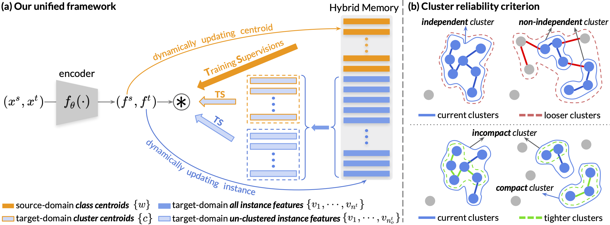
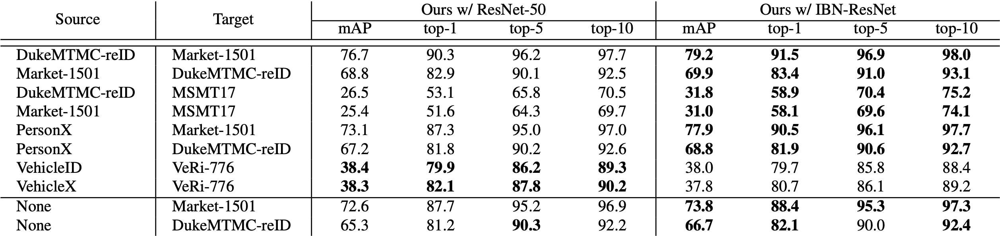

# Self-paced Contrastive Learning (SpCL)

The *official* repository for [Self-paced Contrastive Learning with Hybrid Memory for Domain Adaptive Object Re-ID](https://arxiv.org/abs/2006.02713), which is accepted by [NeurIPS-2020](https://nips.cc/). `SpCL` achieves state-of-the-art performances on both **unsupervised domain adaptation** tasks and **unsupervised learning** tasks for object re-ID, including person re-ID and vehicle re-ID.



### Updates

[2020-10-13] All trained models for the camera-ready version have been updated, see [Trained Models](#trained-models) for details.

[2020-09-25] `SpCL` has been accepted by NeurIPS on the condition that experiments on DukeMTMC-reID dataset should be removed, since the dataset has been taken down and should no longer be used.

[2020-07-01] We did the code refactoring to support distributed training, stronger performances and more features. Please see [OpenUnReID](https://github.com/open-mmlab/OpenUnReID).

## Requirements

### Installation

```shell
git clone https://github.com/yxgeee/SpCL.git
cd SpCL
python setup.py develop
```

### Prepare Datasets

```shell
cd examples && mkdir data
```
Download the person datasets [Market-1501](https://drive.google.com/file/d/0B8-rUzbwVRk0c054eEozWG9COHM/view), [MSMT17](https://arxiv.org/abs/1711.08565), [PersonX](https://github.com/sxzrt/Instructions-of-the-PersonX-dataset#data-for-visda2020-chanllenge), and the vehicle datasets [VehicleID](https://www.pkuml.org/resources/pku-vehicleid.html), [VeRi-776](https://github.com/JDAI-CV/VeRidataset), [VehicleX](https://www.aicitychallenge.org/2020-track2-download/).
Then unzip them under the directory like
```
SpCL/examples/data
├── market1501
│   └── Market-1501-v15.09.15
├── msmt17
│   └── MSMT17_V1
├── personx
│   └── PersonX
├── vehicleid
│   └── VehicleID -> VehicleID_V1.0
├── vehiclex
│   └── AIC20_ReID_Simulation -> AIC20_track2/AIC20_ReID_Simulation
└── veri
    └── VeRi -> VeRi_with_plate
```

### Prepare ImageNet Pre-trained Models for IBN-Net
When training with the backbone of [IBN-ResNet](https://arxiv.org/abs/1807.09441), you need to download the ImageNet-pretrained model from this [link](https://drive.google.com/drive/folders/1thS2B8UOSBi_cJX6zRy6YYRwz_nVFI_S) and save it under the path of `logs/pretrained/`.
```shell
mkdir logs && cd logs
mkdir pretrained
```
The file tree should be
```
SpCL/logs
└── pretrained
    └── resnet50_ibn_a.pth.tar
```
ImageNet-pretrained models for **ResNet-50** will be automatically downloaded in the python script.


## Training

We utilize 4 GTX-1080TI GPUs for training. **Note that**

+ The training for `SpCL` is end-to-end, which means that no source-domain pre-training is required.
+ use `--iters 400` (default) for Market-1501 and PersonX datasets, and `--iters 800` for MSMT17, VeRi-776, VehicleID and VehicleX datasets;
+ use `--width 128 --height 256` (default) for person datasets, and `--height 224 --width 224` for vehicle datasets;
+ use `-a resnet50` (default) for the backbone of ResNet-50, and `-a resnet_ibn50a` for the backbone of IBN-ResNet.

### Unsupervised Domain Adaptation
To train the model(s) in the paper, run this command:
```shell
CUDA_VISIBLE_DEVICES=0,1,2,3 \
python examples/spcl_train_uda.py \
  -ds $SOURCE_DATASET -dt $TARGET_DATASET --logs-dir $PATH_OF_LOGS
```

**Some examples:**
```shell
### PersonX -> Market-1501 ###
# use all default settings is ok
CUDA_VISIBLE_DEVICES=0,1,2,3 \
python examples/spcl_train_uda.py \
  -ds personx -dt market1501 --logs-dir logs/spcl_uda/personx2market_resnet50

### Market-1501 -> MSMT17 ###
# use all default settings except for iters=800
CUDA_VISIBLE_DEVICES=0,1,2,3 \
python examples/spcl_train_uda.py --iters 800 \
  -ds market1501 -dt msmt17 --logs-dir logs/spcl_uda/market2msmt_resnet50

### VehicleID -> VeRi-776 ###
# use all default settings except for iters=800, height=224 and width=224
CUDA_VISIBLE_DEVICES=0,1,2,3 \
python examples/spcl_train_uda.py --iters 800 --height 224 --width 224 \
  -ds vehicleid -dt veri --logs-dir logs/spcl_uda/vehicleid2veri_resnet50
```


### Unsupervised Learning
To train the model(s) in the paper, run this command:
```shell
CUDA_VISIBLE_DEVICES=0,1,2,3 \
python examples/spcl_train_usl.py \
  -d $DATASET --logs-dir $PATH_OF_LOGS
```

**Some examples:**
```shell
### Market-1501 ###
# use all default settings is ok
CUDA_VISIBLE_DEVICES=0,1,2,3 \
python examples/spcl_train_usl.py \
  -d market1501 --logs-dir logs/spcl_usl/market_resnet50

### MSMT17 ###
# use all default settings except for iters=800
CUDA_VISIBLE_DEVICES=0,1,2,3 \
python examples/spcl_train_usl.py --iters 800 \
  -d msmt17 --logs-dir logs/spcl_usl/msmt_resnet50

### VeRi-776 ###
# use all default settings except for iters=800, height=224 and width=224
CUDA_VISIBLE_DEVICES=0,1,2,3 \
python examples/spcl_train_usl.py --iters 800 --height 224 --width 224 \
  -d veri --logs-dir logs/spcl_usl/veri_resnet50
```


## Evaluation

We utilize 1 GTX-1080TI GPU for testing. **Note that**

+ use `--width 128 --height 256` (default) for person datasets, and `--height 224 --width 224` for vehicle datasets;
+ use `--dsbn` for domain adaptive models, and add `--test-source` if you want to test on the source domain;
+ use `-a resnet50` (default) for the backbone of ResNet-50, and `-a resnet_ibn50a` for the backbone of IBN-ResNet.

### Unsupervised Domain Adaptation

To evaluate the domain adaptive model on the **target-domain** dataset, run:
```shell
CUDA_VISIBLE_DEVICES=0 \
python examples/test.py --dsbn \
  -d $DATASET --resume $PATH_OF_MODEL
```

To evaluate the domain adaptive model on the **source-domain** dataset, run:
```shell
CUDA_VISIBLE_DEVICES=0 \
python examples/test.py --dsbn --test-source \
  -d $DATASET --resume $PATH_OF_MODEL
```

**Some examples:**
```shell
### Market-1501 -> MSMT17 ###
# test on the target domain
CUDA_VISIBLE_DEVICES=0 \
python examples/test.py --dsbn \
  -d msmt17 --resume logs/spcl_uda/market2msmt_resnet50/model_best.pth.tar
# test on the source domain
CUDA_VISIBLE_DEVICES=0 \
python examples/test.py --dsbn --test-source \
  -d market1501 --resume logs/spcl_uda/market2msmt_resnet50/model_best.pth.tar
```

### Unsupervised Learning
To evaluate the model, run:
```shell
CUDA_VISIBLE_DEVICES=0 \
python examples/test.py \
  -d $DATASET --resume $PATH
```

**Some examples:**
```shell
### Market-1501 ###
CUDA_VISIBLE_DEVICES=0 \
python examples/test.py \
  -d market1501 --resume logs/spcl_usl/market_resnet50/model_best.pth.tar
```

## Trained Models



You can download the above models in the paper from [[Google Drive]](https://drive.google.com/drive/folders/1ryx-fPGjrexwm9ZP9QO3Qk4SKzNqbaXw?usp=sharing) or [[Baidu Yun]](https://pan.baidu.com/s/1FInOhEdQsOEk-1oMWWB0Ag)(password: w3l9).


## Citation
If you find this code useful for your research, please cite our paper
```
@inproceedings{ge2020selfpaced,
    title={Self-paced Contrastive Learning with Hybrid Memory for Domain Adaptive Object Re-ID},
    author={Yixiao Ge and Feng Zhu and Dapeng Chen and Rui Zhao and Hongsheng Li},
    booktitle={Advances in Neural Information Processing Systems},
    year={2020}
}
```
